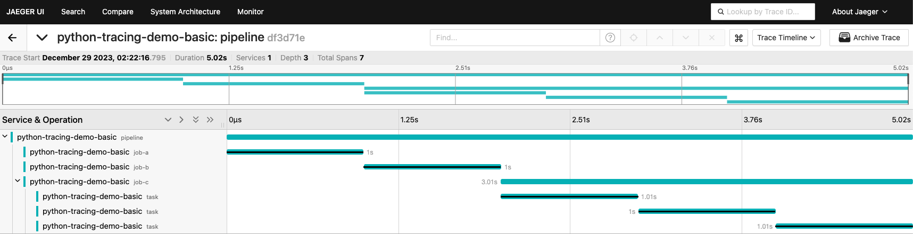
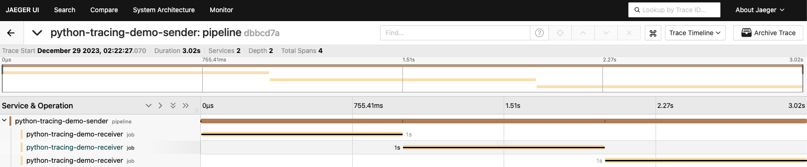

# Python Tracing demo


### How to run the demo

``` bash
# Spin up jaeger
docker-compose up -d

# Install deps
python -m venv venv
source ./venv/bin/activate
pip install -r requirements.txt

# Run the basic tracing app
python app/basic.py

# Run in 2 terminals
python app/receiver.py
python app/sender.py
```

Then go to http://localhost:16686 to see the traces in the jaeger ui.

Basic:


Sender/Receiver:
